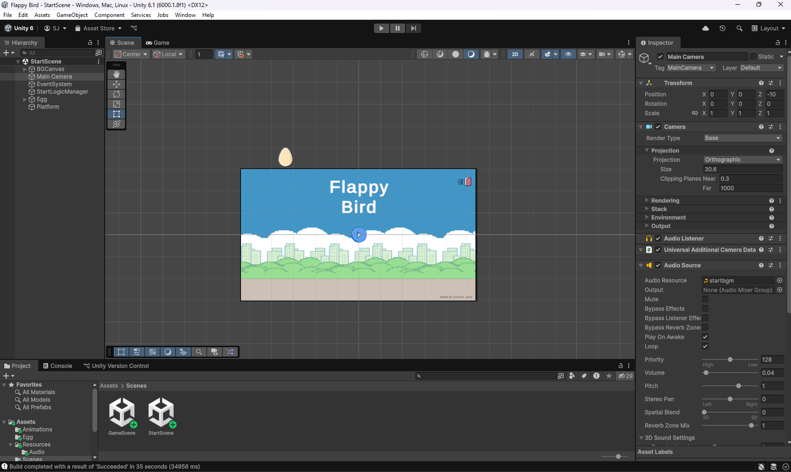
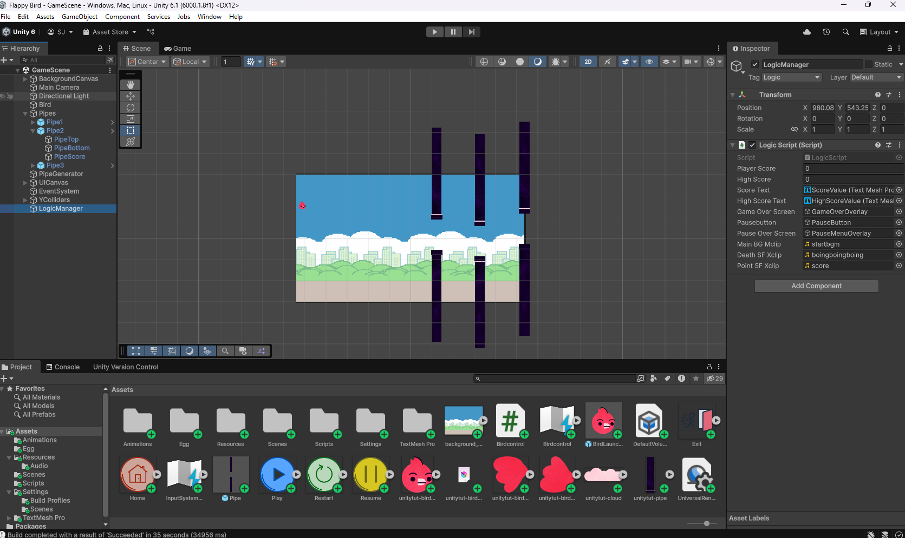

# 🐤 Flappy Bird (Yes, it's a bird not a fish)

This is my very first Unity project — a Flappy Bird Game made to get hands-on experience with Unity's basics like physics, animations, and UI systems.

---

## 🎮 Features

- Menu-driven UI: **Start**, **Pause**, **Home**
- Crazy **fly** animation and a simple **death** animation
- Custom **sound effects**: BGM, death, and scoring
- Personalized **start screen**
- **High score tracking** (with reset option)
- **Increasing difficulty**: bird gradually grows larger

---

## 🕹️ How to Play (Come on, i don't need to tell you this.)

- Use the **Spacebar** to flap and keep the bird airborne
- Avoid pipes and survive as long as possible
- You can pause, resume, and reset from the in-game menu

---

## 🧩 Some Screenshots

### 🎨 Unity Editor Preview

  

---

### 🕹️ In-Game Screenshots

.png)  
.png)  
.png)  

---

## 🚀 How to Run

1. **Download** `FlappyBirdGame.zip`
2. **Extract** the zip
3. Run `Flappy Bird.exe`  
   That’s it — no need to install Unity or anything else.

---

## 📚 Credits & Assets

This project was built following a basic Unity tutorial on YouTube:  
**[Flappy Bird Unity Tutorial by Charger Games](https://www.youtube.com/watch?v=XtQMytORBmM&t=2490s)**

Most assets were from:
- The tutorial’s public assets
- Free images/sounds from **Pixabay**
- A few random visual tweaks made by me

Ofc. I dont own it bro.

---

## 💬 Final Note

Not a polished game — just a fun way to explore Unity and understand how game logic, animation, and UI tie together.  
Hope this helps others getting started too.

